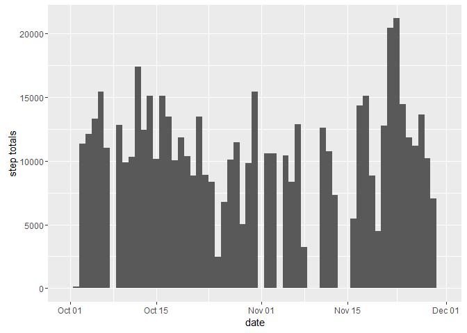
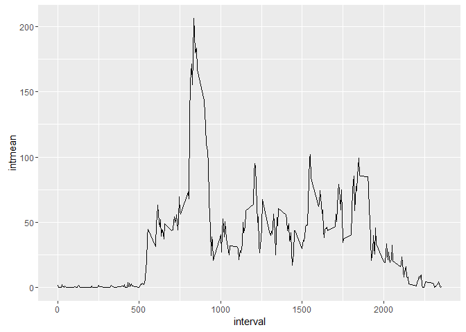
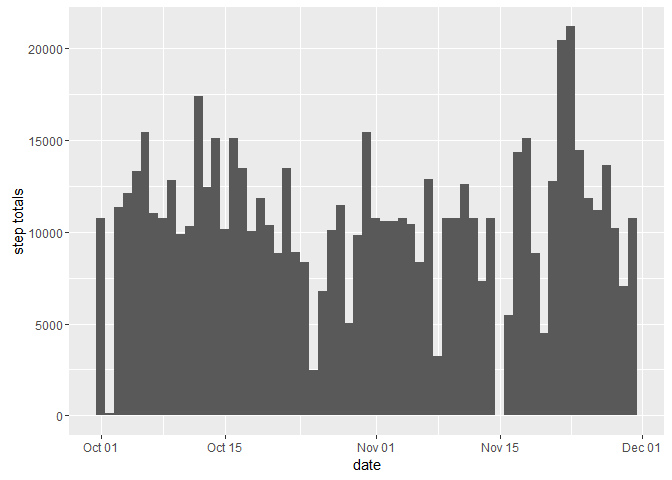
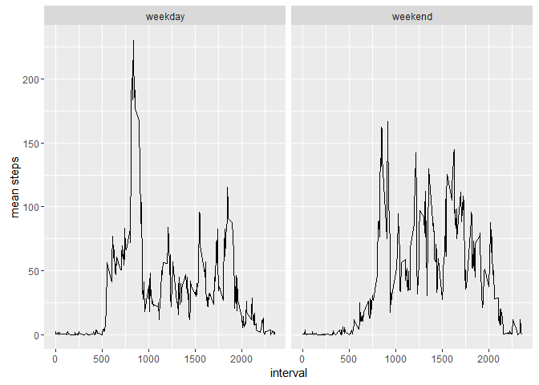

# Activity Data Analysis


## Background

### Assignment
This document is my submission for course project 1 in the Coursera Reproducible Research Class.  It uses data from a  personal activity monitoring device, which "collects data at 5 minute intervals through out the day. The data consists of two months of data from an anonymous individual collected during the months of October and November, 2012 and include the number of steps taken in 5 minute intervals each day." (Peng, Reproducible Research, "Course Project 1", https://www.coursera.org/learn/reproducible-research/peer/gYyPt/course-project-1, retrieved 20160829.)


### Code requirements
This code assumes that the project data are saved and unzipped in the working directory.

This code requires the following packages:

*  plyr
*  ggplot2

Requires the data file to be stored in the working directory.

## Loading and preprocessing the data
Very little data transformation is required; the only adjustments needed are transforming the variable "date" into a date variable after initial import and creating the summary needed for the analysis.

```r
library(plyr)
library(ggplot2)
activitydata<-read.csv("activity.csv")
activitydata$date<-as.Date(activitydata$date)
totals<-ddply(activitydata,.(date),summarise,datesum=sum(steps,na.rm = TRUE))
```

## What is mean total number of steps taken per day?

```r
#create ggplot of histogram of step totals
m<-ggplot(totals,aes(date))
m+geom_histogram(aes(weight=datesum),binwidth = 1)+ylab("step totals")
```

<!-- -->

```r
#get mean/median of steps per day
mean(totals$datesum)
```

```
## [1] 9354.23
```

```r
median(totals$datesum)
```

```
## [1] 10395
```
The mean total steps per day is 9354.2295082.  The median total steps per day is 10395.


## What is the average daily activity pattern?

```r
#figuring out the mean steps/day and creating plot
minutetot<-ddply(activitydata,.(interval),summarise, intmean=mean(steps,na.rm = TRUE))
pat<-ggplot(minutetot,aes(interval,intmean))
pat+geom_line()
```

<!-- -->

```r
#figuring out the maximum value
maxrow<-minutetot[which(minutetot$intmean == max(minutetot$intmean)),]
maxrow
```

```
##     interval  intmean
## 104      835 206.1698
```
The 5-minute interval that, on average across all days in the datasets, contains the maximum number of steps, is 835.

## Imputing missing values
Missing step values are replaced with the average step across all days for the 5-minute interval in which the step is missing.

```r
#determine number of rows with missing data (complete cases)
summary(complete.cases(activitydata))
```

```
##    Mode   FALSE    TRUE    NA's 
## logical    2304   15264       0
```

```r
#build second dataset for use in imputing
activitydata2<-activitydata

#impute missing values using interval means
for(i in 1:nrow(activitydata2)) {
  cur_row<-activitydata2[i,]
  if (is.na(activitydata2$steps[i])) {
    cur_int<-activitydata2[i,3]
    activitydata2$steps[i]<-minutetot$intmean[which(minutetot$interval==cur_int)]}
}

#imputed totals
imp_totals<-ddply(activitydata2,.(date),summarise,datesum=sum(steps,na.rm = TRUE))

#create ggplot of histogram of imputed step totals
imp_m<-ggplot(imp_totals,aes(date))
imp_m+geom_histogram(aes(weight=datesum),binwidth = 1)+ylab("step totals")
```

<!-- -->

```r
#imputed means and medians of total steps
mean(imp_totals$datesum)
```

```
## [1] 10766.19
```

```r
median(imp_totals$datesum)
```

```
## [1] 10766.19
```
The imputed mean, 1.0766189\times 10^{4} and median, 1.0766189\times 10^{4} are slightly larger than the original values, 9354.2295082 (mean)  and 10395 (median).  Imputing the missing data increase the estimate, then, of the total number of steps.

## Are there differences in activity patterns between weekdays and weekends?

```r
#create factor variable for levels of weekday
activitydata2$weekday<-as.factor(weekdays(activitydata$date))
levels(activitydata2$weekday)<-list(weekday=c("Monday","Tuesday","Wednesday","Thursday","Friday"),weekend=c("Saturday","Sunday"))

#create panel plot based on weekday v. weekend mean steps
 ggplot(activitydata2,aes(interval, steps))+stat_summary(fun.y='mean',geom='line')+facet_wrap(~weekday)+labs(y="mean steps")
```

<!-- -->

Weekday step patterns see a dramatic spike in the morninng, but otherwise have lower peaks, while weekend steps appear higher (excess of 100) more often.
